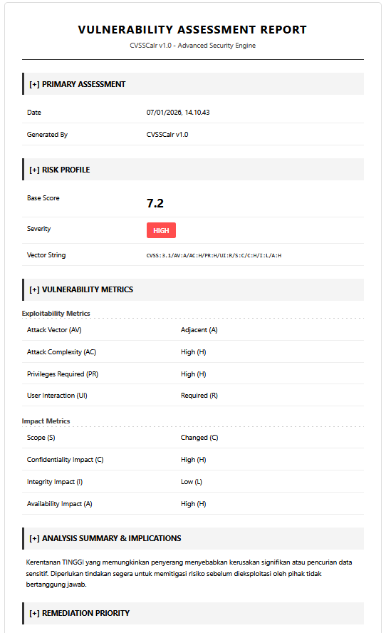
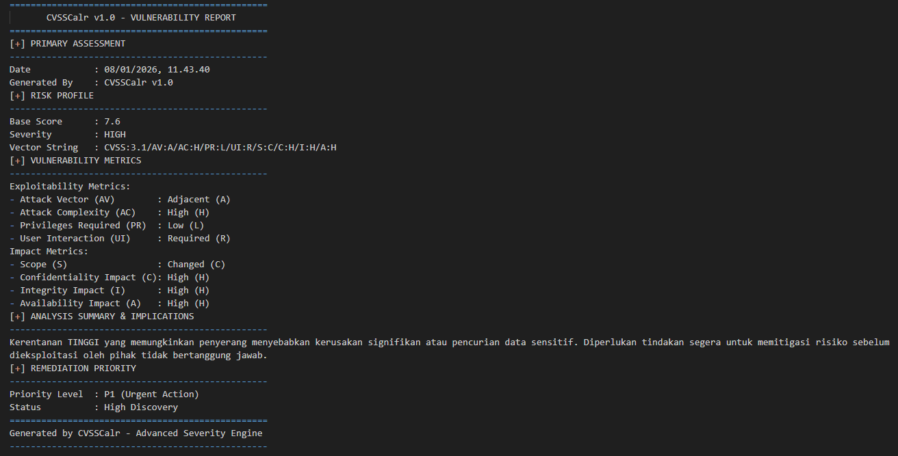
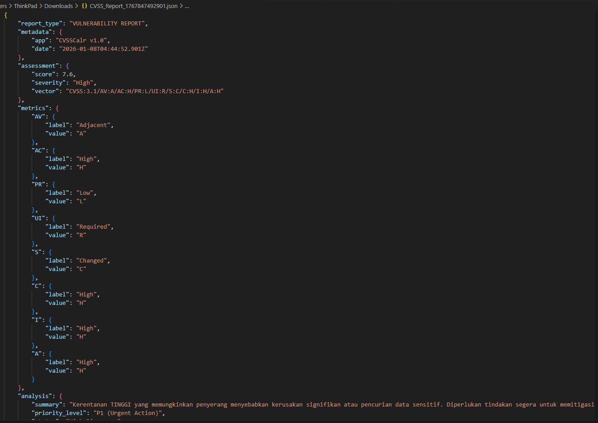
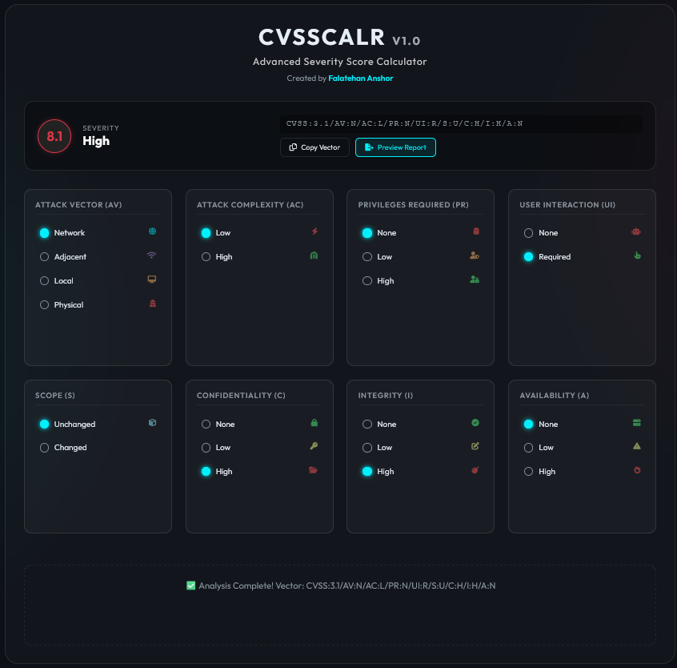
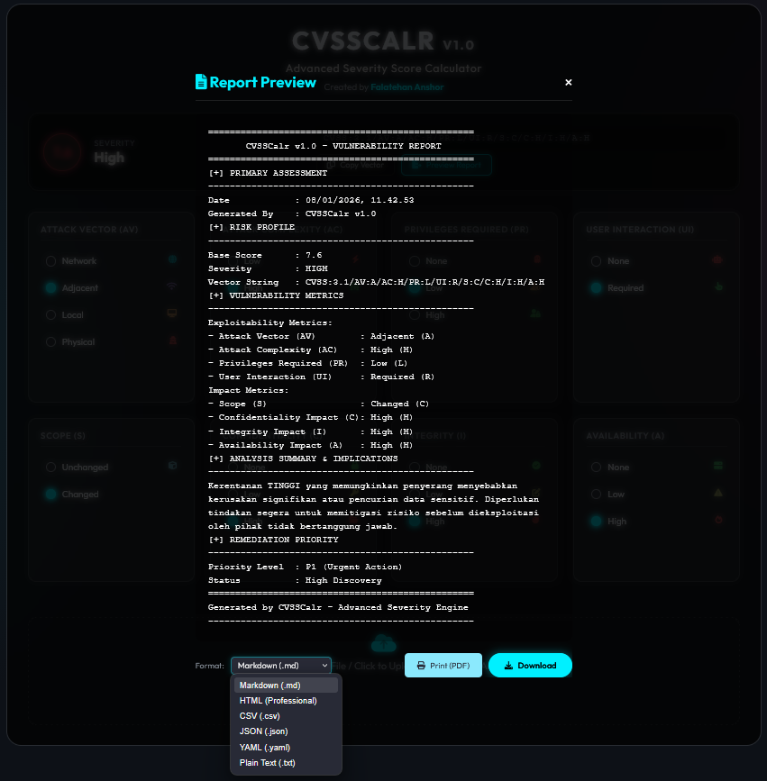
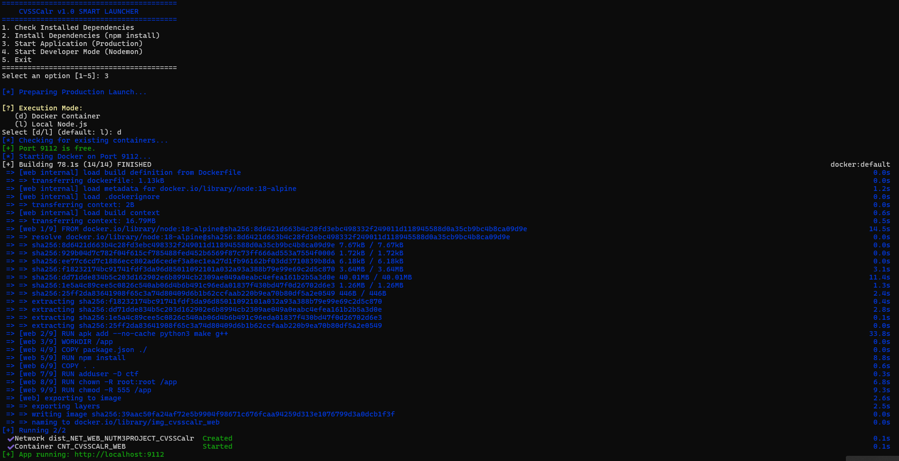
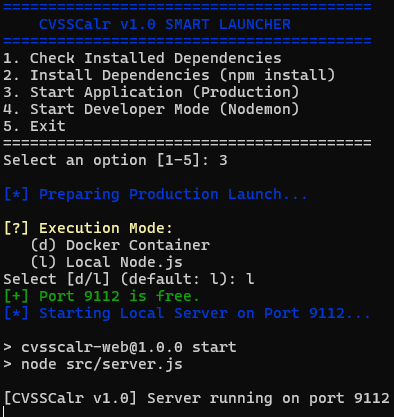

# CVSSCalr v1.0 🛡️
### Enterprise-Grade CVSS 3.1 Scoring Ecosystem & Heuristic Analysis Engine

[](LICENSE)
[](https://www.first.org/cvss/v3.1/specification-document)
[](.)
[](https://nodejs.org/)

> **Architected by [Falatehan Anshor](https://github.com/nutm3)** — Advanced Security Capability Development

---

## ⚡ Executive Summary

**CVSSCalr** is a high-performance vulnerability scoring ecosystem designed to bridge the gap between manual assessment and automated reporting. Built for **Red Team Operations**, **Pentest Engagements**, and **Vulnerability Management**, it delivers precision scoring through a dual-interface architecture.

This tool streamlines the vulnerability lifecycle by integrating **Heuristic Analysis**—transforming raw Proof-of-Concept (PoC) narratives into standard CVSS 3.1 Vectors instantly.

---

## 📸 Interface Preview

### 🌐 The Advanced Web Portal
*Experience a modern, glass-morphism interface optimized for rapid triage.*


### 💻 The High-Speed CLI Core
*Zero-latency terminal performance for offensive security automation.*


---

## 🚀 Operational Capabilities

### 1. **Dual-Core Architecture**
- **Web Portal**: Cyberpunk-themed interface with drag-and-drop heuristic analysis, real-time vector calculation, and visual severity indicators.
- **CLI Suite**: Lightweight, scriptable core designed for headless servers and rapid terminal-based assessments.

### 2. **Next-Gen Reporting Module**
Generate C-Level ready documents and technical exports instantly.

| **Web Reporting Types** | **Visual Preview** |
| :--- | :--- |
| **HTML Executive Report**<br>High-contrast, polished layouts for client delivery. |  |
| **Markdown Documentation**<br>Seamless integration with Git-based docs. |  |
| **JSON Data Structure**<br>Structured data for SIEM ingestion. |  |
| **Heuristic Upload Analysis**<br>Instant vector generation from templates. |  |

*(Full reporting suite also includes CSV and formatted text exports)*



### 3. **Smart Environment Launcher**
Intelligent orchestration script that detects Docker environments, manages dependencies, and handles port conflicts automatically.

| **Deployment Mode** | **Launcher view** |
| :--- | :--- |
| **Docker Container**<br>Isolated, production-ready environment. |  |
| **Local Node.js**<br>Native execution for maximum performance. |  |
| **Intelligent Selection**<br>Auto-prompt for runtime environment. |  |

---

## 🛠️ Deployment & Execution

### **Web Application Container**
Deploy the full graphical experience with our smart launcher.
```bash
cd web
./build.sh  # Auto-detects environment (Docker/Local) and resolves ports
```

### **CLI Assessment Suite**
Execute rapid assessments directly from your terminal. Supports direct PoC file ingestion.
```bash
cd cli
./build.sh  # Instantly compiles and launches the interactive core
```


---

## 🏗️ System Architecture

Engineered for modularity and scalability.

```
CVSSCalr/
├── web/              # Presentation Layer (Express.js + EJS)
│   ├── dist/         # Compiled Production Assets
│   └── build.sh      # Intelligent Environment Orchestrator
├── cli/              # Logic Core (Node.js)
│   ├── dist/         # Application Binaries
│   │   ├── app.js    # Interactive Shell
│   │   ├── lib/      # Core Calculation & Heuristic Modules
│   │   └── report/   # Generated Assessment Artifacts
│   └── build.sh      # Deployment Script
└── imgs/             # Visual Assets & Previews
```

---

## 🎯 Strategic Use Cases

| Persona | Benefit |
| :--- | :--- |
| **Penetration Testers** | Rapidly calculate and export scores for final client report deliverables. |
| **Red Team Operators** | Assess exploit impact and prioritize chains based on severity metrics. |
| **Bug Bounty Hunters** | Validate findings against standard scoring models to maximize payout potential. |
| **DevSecOps** | Integrate JSON/CSV outputs into CI/CD pipelines for automated gating. |

---

## 👨‍💻 Author Profile

**Falatehan Anshor**  
*Offensive Security Specialist | Security Tool Developer*

Dedicated to building high-impact tools that empower the cybersecurity community. Open to collaboration on advanced security augmentation projects.

- **LinkedIn**: [Falatehan Anshor](https://linkedin.com/in/falatehananshor)
- **GitHub**: [@nutm3](https://github.com/nutm3)

---

**Star this Repository** ⭐ to support open-source security innovation.
*Engineered with precision. Deployed with confidence.*
