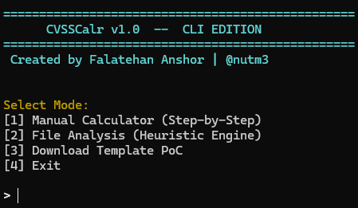
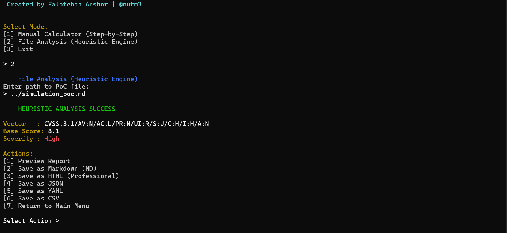

# ⚡ CVSSCalr CLI Suite
### High-Velocity Terminal Scoring Engine


> **Engineered by Falatehan Anshor** — For Headless & Rapid Assessment

---

## 📸 Terminal Capability

### **Interactive Shell**
*A frictionless wizard for rapid CVSS calculation without leaving your terminal.*


### **Heuristic Analysis Mode**
*Feed raw PoC files directly into the engine for instant assessment.*


---

## 🔥 Key Operational Features

### **1. Zero-Latency Calculation**
Built on Node.js, the CLI engine calculates scores instantly, making it perfect for rapid triage during live engagements where every second counts.

### **2. Automated Reporting Pipeline**
Generate structured artifacts straight from the command line. All reports are automatically organized into:
`cli/dist/report/`

- **Markdown**: Instant documentation.
- **HTML**: Professional deliverables.
- **JSON/YAML**: Integration ready.


### **3. Offline Sovereignty**
Perform sensitive vulnerability assessments in air-gapped environments. No data ever leaves your terminal.

---

## 🚀 Execution Protocol

### **Quick Launch**
Initialize the environment with our smart builder:
```bash
cd cli
./build.sh
```

### **Operation Modes**
1.  **Manual Calculator**: Interactive step-by-step wizard.
2.  **File Analysis**: Heuristic scanner for local PoC files.

---

## 🎨 Visual Feedback System

We utilize high-fidelity ANSI color codes for immediate situational awareness:

- 🟣 **MAGENTA**: Critical Severity (Score 9.0 - 10.0)
- 🔴 **RED**: High Severity (Score 7.0 - 8.9)
- 🟡 **YELLOW**: Medium Severity (Score 4.0 - 6.9)
- 🟢 **GREEN**: Low Severity / Success

---

## 🛠️ Integration Notes

The CLI is designed to be pipe-friendly. Future updates will allow for STDIN/STDOUT piping for seamless integration with tools like `grep`, `awk`, and custom bash scripts.

---

## Integration Notes

The CLI is designed for pipe-friendly operations. Future updates will incorporate STDIN/STDOUT piping for seamless integration with tools such as `grep`, `awk`, and custom bash scripts.

---

## Engineer

**Falatehan Anshor**  
*Offensive Security Specialist*

*Terminal power meets security intelligence.*
