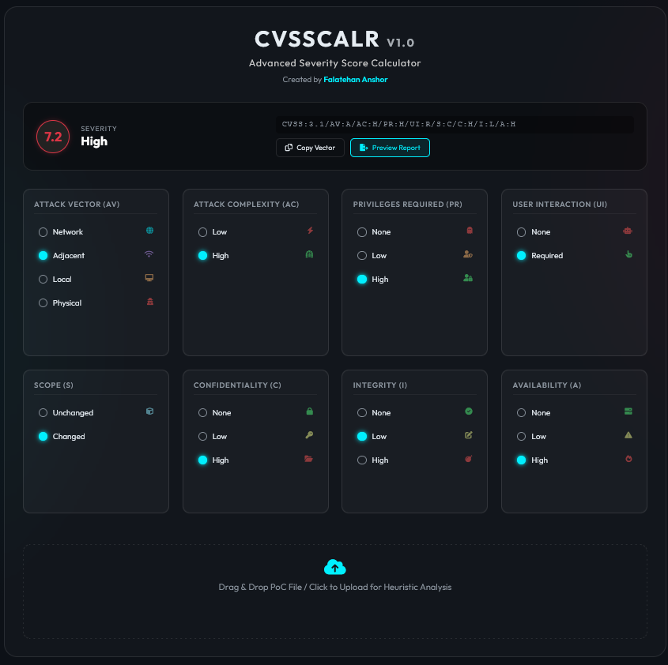

# 🌐 CVSSCalr Web Portal
### Advanced Vulnerability Analytics Interface

 


> **Designed by Falatehan Anshor** — Optimized for Modern Security Operations

---

## 📸 Interface Gallery

### **The Command Center**
*A unified dashboard for vector calculation, heuristic uploading, and real-time visualization.*


### **Executive Reporting Engine**
*Transform raw data into C-Level actionable intelligence instantly.*


---

## ✨ Core Capabilities

### 1. **Heuristic Intelligence**
Drag-and-drop your `template_poc.md` or raw notes directly into the analysis zone. The engine parses contextual keywords to auto-suggest CVSS metrics.

### 2. **Professional Reporting Suite**
Export findings in formats ready for client delivery or engineering handoff.

| **Report Type** | **Preview** |
| :--- | :--- |
| **HTML Executive** |  |
| **Markdown Docs** |  |
| **JSON Data** |  |
| **Heuristic View** |  |

*(See full report capability below)*


### 3. **Cyberpunk UX Design**
Built with a "Glassmorphism" aesthetic that reduces eye strain during late-night engagements while providing clear, color-coded visual feedback.

---

## 🚀 Deployment Guide

### **Automated Smart Launcher**
Our intelligent `build.sh` handles Docker lifecycle, port conflict resolution, and dependency management.

```bash
cd web
./build.sh
```

**Launcher Modes:**
1. **Local Node.js**: Fast, native execution.


2. **Docker Container**: Isolated production environment.


3. **Smart Selection**: Interactive mode choice.


---

## 📊 Application Logic

1.  **Input Vector**: Manually select metrics OR upload a PoC file.
2.  **Process**: The Core Engine calculates Base Score, Impact, and Exploitability.
3.  **Output**: Real-time score updates and severity classification.
4.  **Export**: Generate comprehensive reports with a single click.

---

## 🔧 Infrastructure Configuration

Create a `.env` file in `web/dist/` for custom port management:
```env
PORT=9112  # Default Application Port
```

---

## 👨‍💻 Engineer

**Falatehan Anshor**  
*Offensive Security Specialist*

Empowering Pentest Teams with next-generation tooling.
